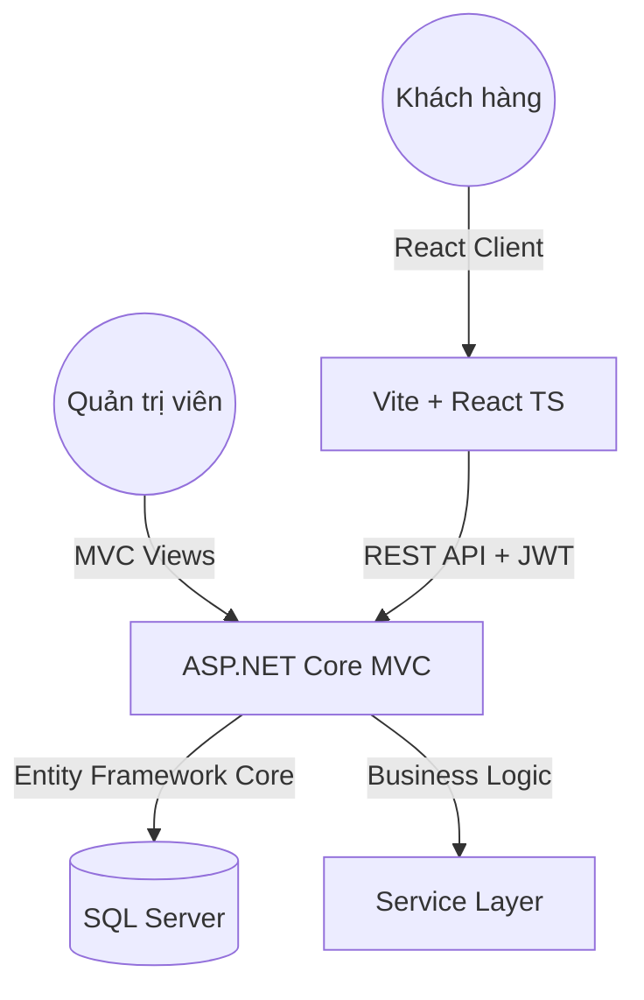

# 💈 Barber Shop Management System (QLCT) ✂️

[](https://dotnet.microsoft.com/en-us/apps/aspnet)
[](https://vitejs.dev/)
[](https://www.microsoft.com/en-us/sql-server/)
[](#)

Hệ thống quản lý tiệm hớt tóc hiện đại, tích hợp đặt lịch trực tuyến, quản lý nhân sự, kho hàng và hệ thống báo cáo doanh thu chuyên nghiệp. Dự án được phát triển với kiến trúc **Fullstack decoupling** giữa Backend ASP.NET Core MVC/API và Frontend React.

---

## 🌟 Tính Năng Chính

### 🙋 Dành Cho Khách Hàng (Client Portal)
- **Đặt lịch (Booking):** Quy trình đặt lịch trực quan theo thời gian thực.
- **Hệ thống Cửa hàng:** Xem và mua các sản phẩm chăm sóc tóc.
- **Lịch sử & Đánh giá:** Xem lại lịch sử cắt tóc và gửi phản hồi cho thợ.
- **Quản lý hồ sơ:** Tự cập nhật thông tin cá nhân và mật khẩu.

### 💼 Dành Cho Quản Trị (Admin Dashboard)
- **Tổng quan (Revenue):** Biểu đồ thống kê doanh thu, số lượt khách theo ngày/tháng.
- **Quản lý Nhân sự:** Phân ca làm việc (Shifts) và tính hoa hồng.
- **Quản lý Dịch vụ & Kho:** Cập nhật bảng giá dịch vụ và tồn kho sản phẩm.
- **Quản lý Hóa đơn:** In và xuất dữ liệu hóa đơn chuyên nghiệp.

---

## 🏗️ Kiến Trúc Hệ Thống



---

## 🛠️ Công Nghệ Sử Dụng

| Thành phần | Công nghệ |
| :--- | :--- |
| **Backend** | .NET 8.0 ASP.NET Core, EF Core |
| **Frontend** | React 18, Vite, TypeScript, Tailwind CSS |
| **Authentication** | Cookie Authentication (Client/Admin) & JWT (API) |
| **Database** | SQL Server |
| **Tools** | Git Flow, GitHub CLI, PowerShell Automation |

---

## 🚀 Hướng Dẫn Cài Đặt

### 1. Yêu Cầu Hệ Thống
- [.NET 8.0 SDK](https://dotnet.microsoft.com/download)
- [Node.js (v18+)](https://nodejs.org/)
- [SQL Server](https://www.microsoft.com/en-us/sql-server/)

### 2. Thiết Lập Backend
```bash
# Clone dự án
git clone https://github.com/Tinnguyen8426/QLCT_React.git

# Cấu hình chuỗi kết nối trong appsettings.json
# Run Migrations
dotnet ef database update

# Chạy Server
dotnet run
```

### 3. Thiết Lập Frontend
```bash
cd client
npm install
npm run dev
```

---

## 👥 Đội Ngũ Phát Triển (Đồ Án Nhóm)

- **Tin Nguyễn (Leader):** Authentication, Infrastructure & Deployment.
- **Ngô Phong:** Booking Logic, Customer Portal & Services.
- **Đỗ Vinh Quang:** Storefront, Invoices & Statistics.

---

## 📄 Giấy Phép & Tài Liệu
Dự án được phát triển phục vụ mục đích học thuật. Mọi thắc mắc vui lòng liên hệ qua GitHub Issues.

---
© 2026 **PTPM Group** - Đồ án Quản lý phần mềm.
